## Load Wine Dataset


```python
from sklearn.datasets import load_wine
wine = load_wine()
```


```python
print(wine.keys())
```

    dict_keys(['data', 'target', 'target_names', 'DESCR', 'feature_names'])


```python
print(wine.data.shape)
print(wine.target.shape)
print(wine.target_names)
print(wine.feature_names)

print(wine.DESCR)
```

    (178, 13)
    (178,)
    ['class_0' 'class_1' 'class_2']
    ['alcohol', 'malic_acid', 'ash', 'alcalinity_of_ash', 'magnesium', 'total_phenols', 'flavanoids', 'nonflavanoid_phenols', 'proanthocyanins', 'color_intensity', 'hue', 'od280/od315_of_diluted_wines', 'proline']
    Wine Data Database
    ====================
    
    Notes
    -----
    Data Set Characteristics:
        :Number of Instances: 178 (50 in each of three classes)
        :Number of Attributes: 13 numeric, predictive attributes and the class
        :Attribute Information:
     		- 1) Alcohol
     		- 2) Malic acid
     		- 3) Ash
    		- 4) Alcalinity of ash  
     		- 5) Magnesium
    		- 6) Total phenols
     		- 7) Flavanoids
     		- 8) Nonflavanoid phenols
     		- 9) Proanthocyanins
    		- 10)Color intensity
     		- 11)Hue
     		- 12)OD280/OD315 of diluted wines
     		- 13)Proline
            	- class:
                    - class_0
                    - class_1
                    - class_2
    		
        :Summary Statistics:
        
        ============================= ==== ===== ======= =====
                                       Min   Max   Mean     SD
        ============================= ==== ===== ======= =====
        Alcohol:                      11.0  14.8    13.0   0.8
        Malic Acid:                   0.74  5.80    2.34  1.12
        Ash:                          1.36  3.23    2.36  0.27
        Alcalinity of Ash:            10.6  30.0    19.5   3.3
        Magnesium:                    70.0 162.0    99.7  14.3
        Total Phenols:                0.98  3.88    2.29  0.63
        Flavanoids:                   0.34  5.08    2.03  1.00
        Nonflavanoid Phenols:         0.13  0.66    0.36  0.12
        Proanthocyanins:              0.41  3.58    1.59  0.57
        Colour Intensity:              1.3  13.0     5.1   2.3
        Hue:                          0.48  1.71    0.96  0.23
        OD280/OD315 of diluted wines: 1.27  4.00    2.61  0.71
        Proline:                       278  1680     746   315
        ============================= ==== ===== ======= =====
    
        :Missing Attribute Values: None
        :Class Distribution: class_0 (59), class_1 (71), class_2 (48)
        :Creator: R.A. Fisher
        :Donor: Michael Marshall (MARSHALL%PLU@io.arc.nasa.gov)
        :Date: July, 1988
    
    This is a copy of UCI ML Wine recognition datasets.
    https://archive.ics.uci.edu/ml/machine-learning-databases/wine/wine.data
    
    The data is the results of a chemical analysis of wines grown in the same
    region in Italy by three different cultivators. There are thirteen different
    measurements taken for different constituents found in the three types of
    wine.
    
    Original Owners: 
    
    Forina, M. et al, PARVUS - 
    An Extendible Package for Data Exploration, Classification and Correlation. 
    Institute of Pharmaceutical and Food Analysis and Technologies,
    Via Brigata Salerno, 16147 Genoa, Italy.
    
    Citation:
    
    Lichman, M. (2013). UCI Machine Learning Repository
    [http://archive.ics.uci.edu/ml]. Irvine, CA: University of California,
    School of Information and Computer Science. 
    
    References
    ----------
    (1) 
    S. Aeberhard, D. Coomans and O. de Vel, 
    Comparison of Classifiers in High Dimensional Settings, 
    Tech. Rep. no. 92-02, (1992), Dept. of Computer Science and Dept. of 
    Mathematics and Statistics, James Cook University of North Queensland. 
    (Also submitted to Technometrics). 
    
    The data was used with many others for comparing various 
    classifiers. The classes are separable, though only RDA 
    has achieved 100% correct classification. 
    (RDA : 100%, QDA 99.4%, LDA 98.9%, 1NN 96.1% (z-transformed data)) 
    (All results using the leave-one-out technique) 
    
    (2) 
    S. Aeberhard, D. Coomans and O. de Vel, 
    "THE CLASSIFICATION PERFORMANCE OF RDA" 
    Tech. Rep. no. 92-01, (1992), Dept. of Computer Science and Dept. of 
    Mathematics and Statistics, James Cook University of North Queensland. 
    (Also submitted to Journal of Chemometrics). 
    


## Use pandas for handling data


```python
import matplotlib.pyplot as plt
import pandas as pd

%matplotlib inline

df = pd.DataFrame(wine.data, columns = wine.feature_names)
df['target'] = wine.target
```


```python
df.describe()
```


<div>
<style scoped>
    .dataframe tbody tr th:only-of-type {
        vertical-align: middle;
    }

    .dataframe tbody tr th {
        vertical-align: top;
    }

    .dataframe thead th {
        text-align: right;
    }
</style>
<table border="1" class="dataframe">
  <thead>
    <tr style="text-align: right;">
      <th></th>
      <th>alcohol</th>
      <th>malic_acid</th>
      <th>ash</th>
      <th>alcalinity_of_ash</th>
      <th>magnesium</th>
      <th>total_phenols</th>
      <th>flavanoids</th>
      <th>nonflavanoid_phenols</th>
      <th>proanthocyanins</th>
      <th>color_intensity</th>
      <th>hue</th>
      <th>od280/od315_of_diluted_wines</th>
      <th>proline</th>
      <th>target</th>
    </tr>
  </thead>
  <tbody>
    <tr>
      <th>count</th>
      <td>178.000000</td>
      <td>178.000000</td>
      <td>178.000000</td>
      <td>178.000000</td>
      <td>178.000000</td>
      <td>178.000000</td>
      <td>178.000000</td>
      <td>178.000000</td>
      <td>178.000000</td>
      <td>178.000000</td>
      <td>178.000000</td>
      <td>178.000000</td>
      <td>178.000000</td>
      <td>178.000000</td>
    </tr>
    <tr>
      <th>mean</th>
      <td>13.000618</td>
      <td>2.336348</td>
      <td>2.366517</td>
      <td>19.494944</td>
      <td>99.741573</td>
      <td>2.295112</td>
      <td>2.029270</td>
      <td>0.361854</td>
      <td>1.590899</td>
      <td>5.058090</td>
      <td>0.957449</td>
      <td>2.611685</td>
      <td>746.893258</td>
      <td>0.938202</td>
    </tr>
    <tr>
      <th>std</th>
      <td>0.811827</td>
      <td>1.117146</td>
      <td>0.274344</td>
      <td>3.339564</td>
      <td>14.282484</td>
      <td>0.625851</td>
      <td>0.998859</td>
      <td>0.124453</td>
      <td>0.572359</td>
      <td>2.318286</td>
      <td>0.228572</td>
      <td>0.709990</td>
      <td>314.907474</td>
      <td>0.775035</td>
    </tr>
    <tr>
      <th>min</th>
      <td>11.030000</td>
      <td>0.740000</td>
      <td>1.360000</td>
      <td>10.600000</td>
      <td>70.000000</td>
      <td>0.980000</td>
      <td>0.340000</td>
      <td>0.130000</td>
      <td>0.410000</td>
      <td>1.280000</td>
      <td>0.480000</td>
      <td>1.270000</td>
      <td>278.000000</td>
      <td>0.000000</td>
    </tr>
    <tr>
      <th>25%</th>
      <td>12.362500</td>
      <td>1.602500</td>
      <td>2.210000</td>
      <td>17.200000</td>
      <td>88.000000</td>
      <td>1.742500</td>
      <td>1.205000</td>
      <td>0.270000</td>
      <td>1.250000</td>
      <td>3.220000</td>
      <td>0.782500</td>
      <td>1.937500</td>
      <td>500.500000</td>
      <td>0.000000</td>
    </tr>
    <tr>
      <th>50%</th>
      <td>13.050000</td>
      <td>1.865000</td>
      <td>2.360000</td>
      <td>19.500000</td>
      <td>98.000000</td>
      <td>2.355000</td>
      <td>2.135000</td>
      <td>0.340000</td>
      <td>1.555000</td>
      <td>4.690000</td>
      <td>0.965000</td>
      <td>2.780000</td>
      <td>673.500000</td>
      <td>1.000000</td>
    </tr>
    <tr>
      <th>75%</th>
      <td>13.677500</td>
      <td>3.082500</td>
      <td>2.557500</td>
      <td>21.500000</td>
      <td>107.000000</td>
      <td>2.800000</td>
      <td>2.875000</td>
      <td>0.437500</td>
      <td>1.950000</td>
      <td>6.200000</td>
      <td>1.120000</td>
      <td>3.170000</td>
      <td>985.000000</td>
      <td>2.000000</td>
    </tr>
    <tr>
      <th>max</th>
      <td>14.830000</td>
      <td>5.800000</td>
      <td>3.230000</td>
      <td>30.000000</td>
      <td>162.000000</td>
      <td>3.880000</td>
      <td>5.080000</td>
      <td>0.660000</td>
      <td>3.580000</td>
      <td>13.000000</td>
      <td>1.710000</td>
      <td>4.000000</td>
      <td>1680.000000</td>
      <td>2.000000</td>
    </tr>
  </tbody>
</table>
</div>


```python
df.head()
```


<div>
<style scoped>
    .dataframe tbody tr th:only-of-type {
        vertical-align: middle;
    }

    .dataframe tbody tr th {
        vertical-align: top;
    }

    .dataframe thead th {
        text-align: right;
    }
</style>
<table border="1" class="dataframe">
  <thead>
    <tr style="text-align: right;">
      <th></th>
      <th>alcohol</th>
      <th>malic_acid</th>
      <th>ash</th>
      <th>alcalinity_of_ash</th>
      <th>magnesium</th>
      <th>total_phenols</th>
      <th>flavanoids</th>
      <th>nonflavanoid_phenols</th>
      <th>proanthocyanins</th>
      <th>color_intensity</th>
      <th>hue</th>
      <th>od280/od315_of_diluted_wines</th>
      <th>proline</th>
      <th>target</th>
    </tr>
  </thead>
  <tbody>
    <tr>
      <th>0</th>
      <td>14.23</td>
      <td>1.71</td>
      <td>2.43</td>
      <td>15.6</td>
      <td>127.0</td>
      <td>2.80</td>
      <td>3.06</td>
      <td>0.28</td>
      <td>2.29</td>
      <td>5.64</td>
      <td>1.04</td>
      <td>3.92</td>
      <td>1065.0</td>
      <td>0</td>
    </tr>
    <tr>
      <th>1</th>
      <td>13.20</td>
      <td>1.78</td>
      <td>2.14</td>
      <td>11.2</td>
      <td>100.0</td>
      <td>2.65</td>
      <td>2.76</td>
      <td>0.26</td>
      <td>1.28</td>
      <td>4.38</td>
      <td>1.05</td>
      <td>3.40</td>
      <td>1050.0</td>
      <td>0</td>
    </tr>
    <tr>
      <th>2</th>
      <td>13.16</td>
      <td>2.36</td>
      <td>2.67</td>
      <td>18.6</td>
      <td>101.0</td>
      <td>2.80</td>
      <td>3.24</td>
      <td>0.30</td>
      <td>2.81</td>
      <td>5.68</td>
      <td>1.03</td>
      <td>3.17</td>
      <td>1185.0</td>
      <td>0</td>
    </tr>
    <tr>
      <th>3</th>
      <td>14.37</td>
      <td>1.95</td>
      <td>2.50</td>
      <td>16.8</td>
      <td>113.0</td>
      <td>3.85</td>
      <td>3.49</td>
      <td>0.24</td>
      <td>2.18</td>
      <td>7.80</td>
      <td>0.86</td>
      <td>3.45</td>
      <td>1480.0</td>
      <td>0</td>
    </tr>
    <tr>
      <th>4</th>
      <td>13.24</td>
      <td>2.59</td>
      <td>2.87</td>
      <td>21.0</td>
      <td>118.0</td>
      <td>2.80</td>
      <td>2.69</td>
      <td>0.39</td>
      <td>1.82</td>
      <td>4.32</td>
      <td>1.04</td>
      <td>2.93</td>
      <td>735.0</td>
      <td>0</td>
    </tr>
  </tbody>
</table>
</div>


## Visualize

### Histgram and boxplot


```python
def plot_feature(feature_name):
    fig, axes = plt.subplots(1, 2)
    
    # figure
    title = 'feature: %s' % feature_name
    fig.suptitle(title, fontsize=12)
    fig.tight_layout(pad=2.0, w_pad=2.0, h_pad=5.0)
    fig.set_size_inches((10, 4))

    # histgram
    for i, klass in zip(range(len(wine.target_names)), wine.target_names):
        x = df[wine.target == i][feature_name]
        axes[0].hist(x, histtype='bar', label=klass, alpha = 0.75)

    axes[0].legend(loc='upper right') 
    axes[0].set_ylabel('frequency')

    # boxplot
    class_values = []
    for i, klass in zip(range(len(wine.target_names)), wine.target_names):
        series = df[wine.target == i][feature_name]
        class_values.append(series.values)

    axes[1].boxplot(class_values, labels = wine.target_names)

    
for feature_name in wine.feature_names:
    plot_feature(feature_name)

plt.show()
```


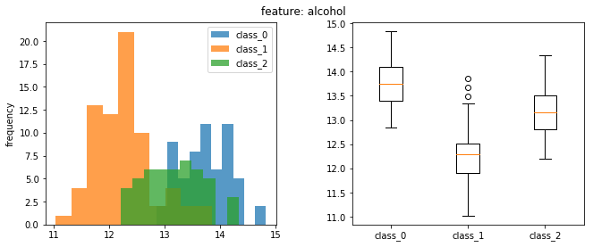


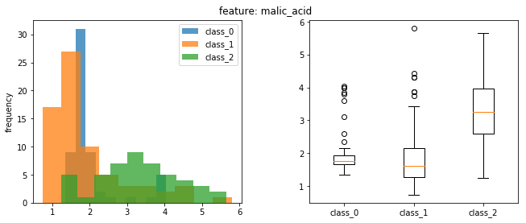


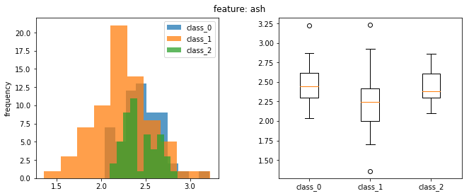


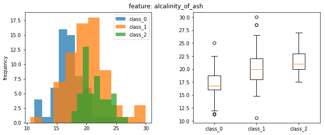


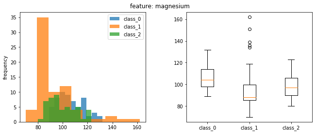


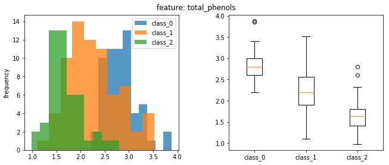


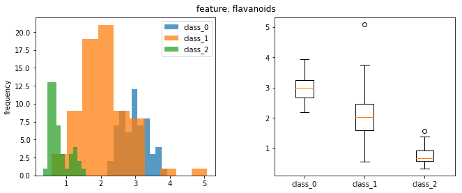


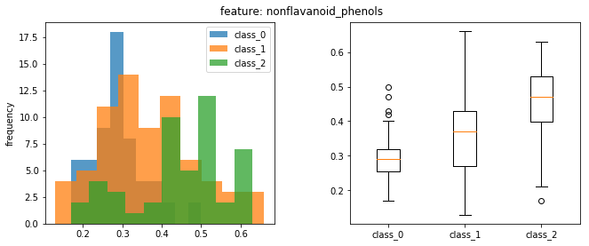


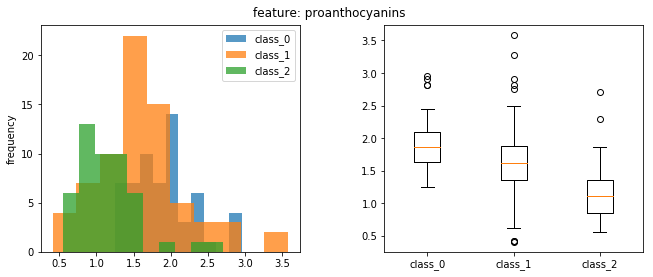


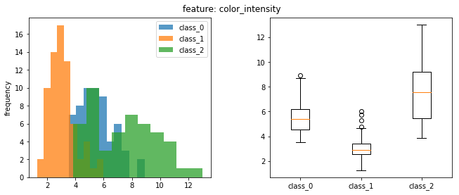


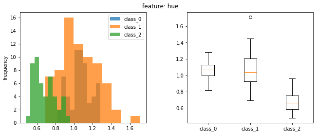


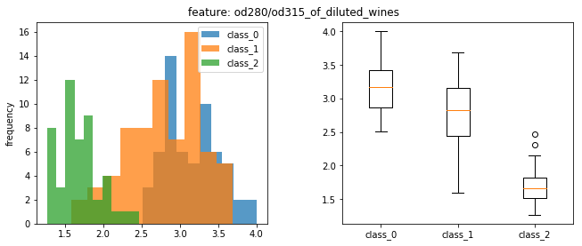


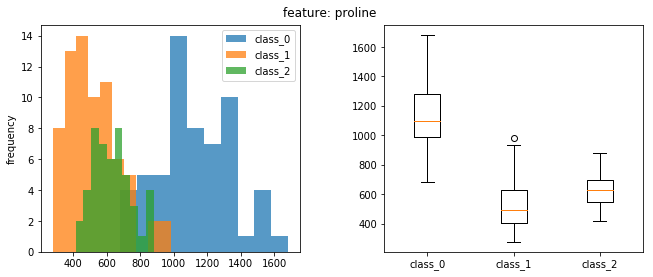


###  Scatter Plot


```python
import itertools
for f1, f2 in itertools.combinations(wine.feature_names,2):
    fig = plt.figure()
    
    for yi, target_name in zip(range(len(wine.target_names)), wine.target_names):
        plt.scatter(df[wine.target == yi][f1], df[wine.target == yi][f2], label = target_name)
    
    plt.xlabel(f1)
    plt.ylabel(f2)
    plt.legend()
    plt.show()
```


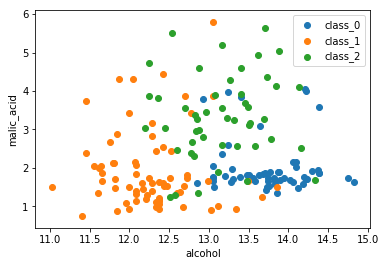


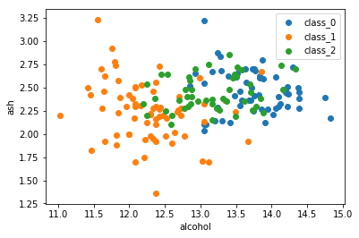


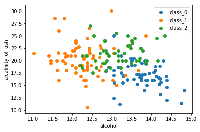


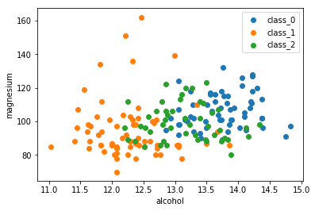


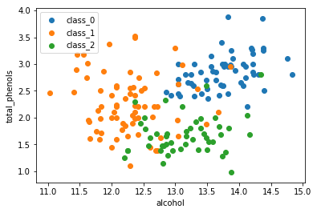


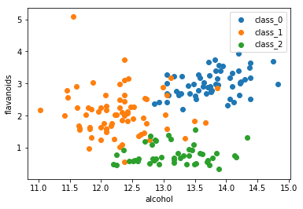


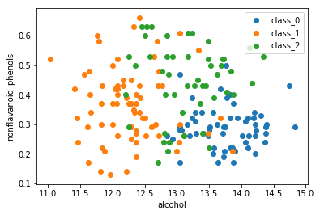


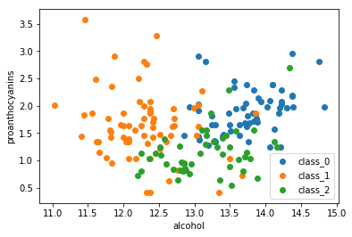


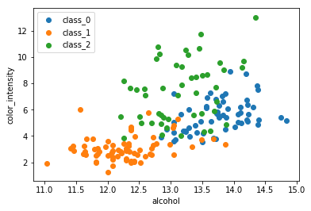


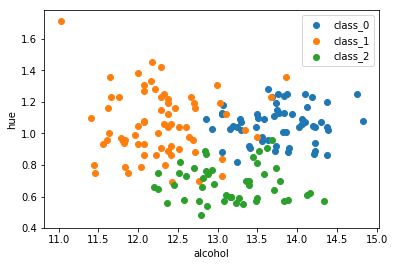


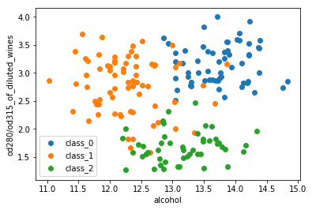


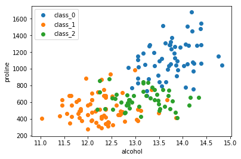


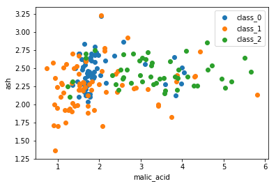


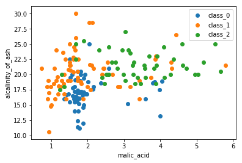


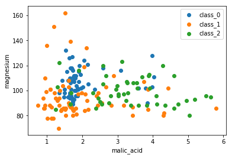


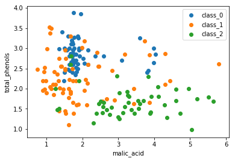


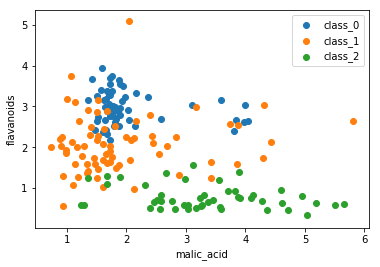


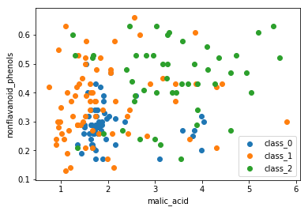


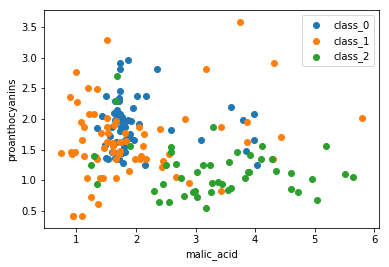


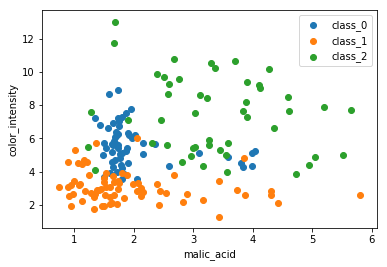


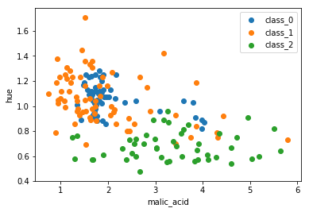


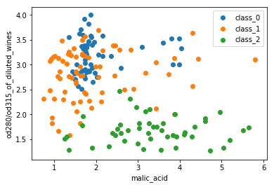


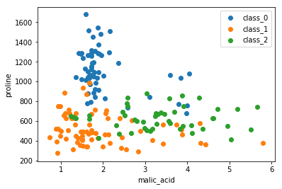


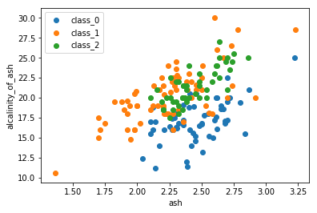


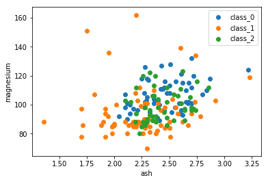


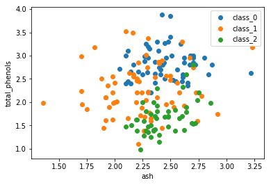


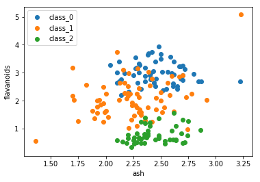


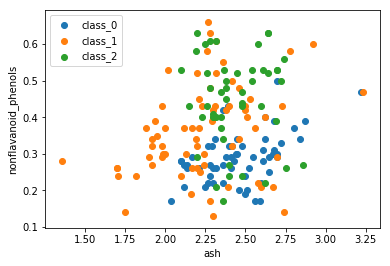


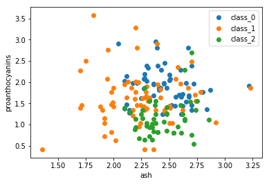


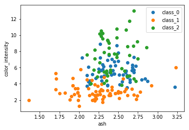


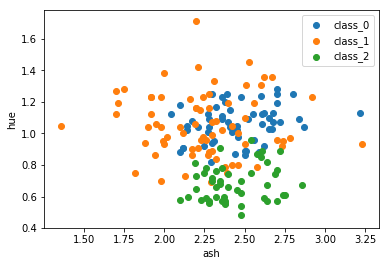


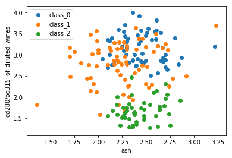


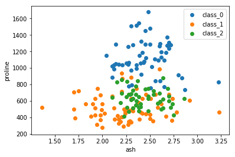


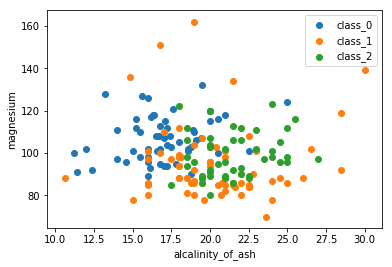


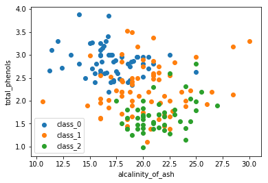


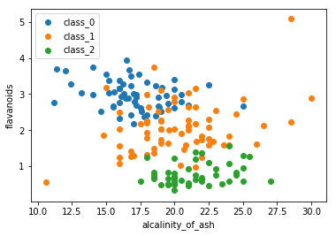


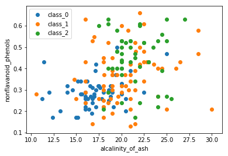


## Learning

### with full features


```python
from sklearn.svm import SVC
clf = SVC(kernel = 'linear', C = 1)

from sklearn.model_selection import cross_val_score
scores = cross_val_score(clf, wine.data, wine.target, cv=5)

print(scores.mean())
```

    0.961861861861862


### with selected features


```python
clf = SVC(kernel = 'linear', C = 1)
selected_features = ['alcohol', 'malic_acid', 'ash',  'magnesium',  'flavanoids', 'color_intensity',  'proline']
X = df.filter(items=selected_features).values
Y = df['target']

scores = cross_val_score(clf, X, Y, cv=5)

print(scores.mean())
```

    0.9836336336336335


## Test


```python
from sklearn.model_selection import train_test_split

selected_features = ['alcohol', 'malic_acid', 'ash',  'magnesium', 'total_phenols', 'flavanoids', 'color_intensity', 'od280/od315_of_diluted_wines', 'proline']
# all_features = ['alcohol', 'malic_acid', 'ash', 'alcalinity_of_ash', 'magnesium', 'total_phenols', 'flavanoids', 'nonflavanoid_phenols', 'proanthocyanins', 'color_intensity', 'hue', 'od280/od315_of_diluted_wines', 'proline']
X = df.filter(items=selected_features).values
Y = df['target']

for i in range(10):
    X_train, X_test, y_train, y_test = train_test_split(X, Y, test_size=0.1)
    clf = SVC(kernel = 'linear', C = 1)
    clf.fit(X_train, y_train)

    print(clf.score(X_test, y_test))
```

    1.0
    1.0
    1.0
    0.9444444444444444
    0.8333333333333334
    0.9444444444444444
    1.0
    1.0
    1.0
    0.9444444444444444

